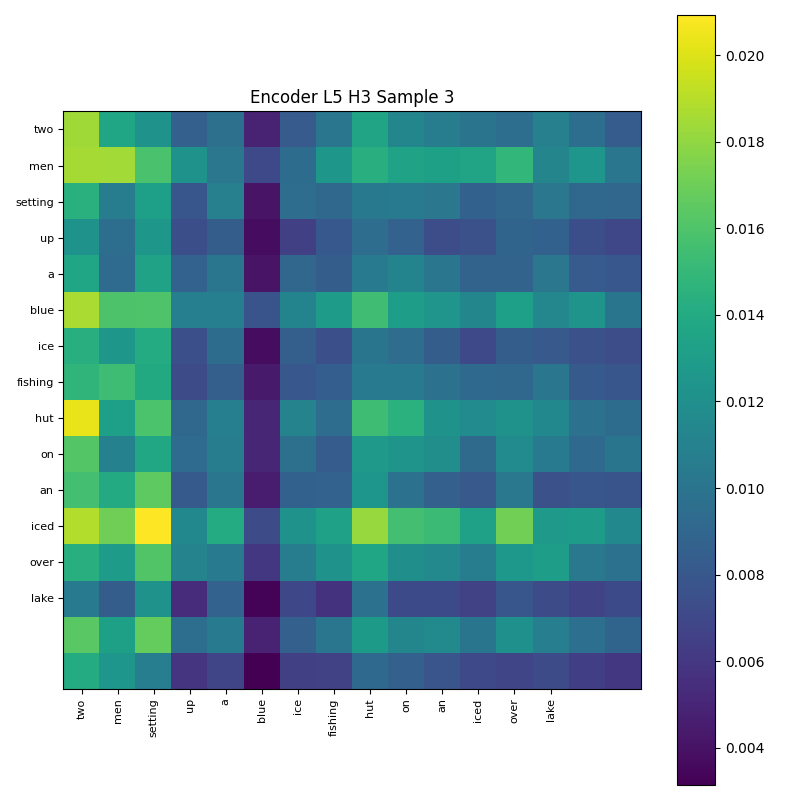
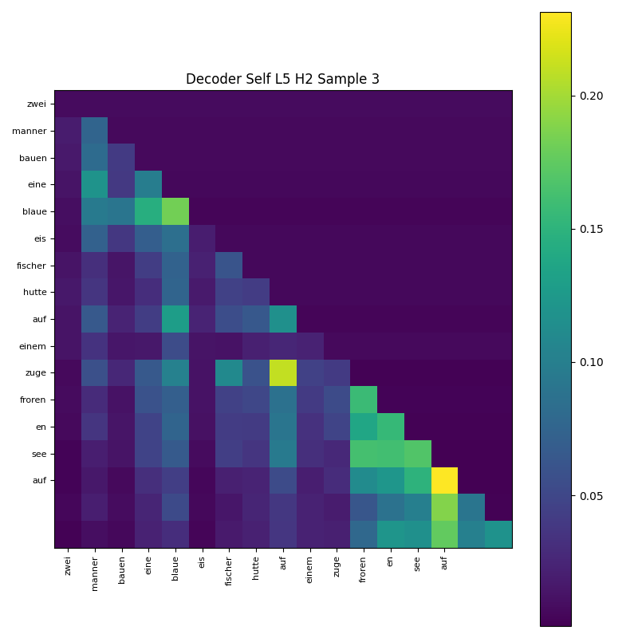

# 🧪 Experiment Report: Attention Is All You Need

> **Paper:** Vaswani et al., 2017 — *Attention Is All You Need*  
> **Organization:** Google Brain  
> **Stage:** Representation  

---

## ⚙️ Experiment Setup

| Component | Details |
|------------|----------|
| Model | Transformer (Encoder–Decoder), DONE |
| Dataset | Multi30k |
| Training | DONE |
| Hardware | A100 |
| Framework | Pytorch |

---

## 📊 Quantitative Results

| Metric | Original (Paper) | Reproduced | Deviation | Notes |
|---------|------------------|-------------|------------|--------|
| BLEU (EN→DE) | 28.4 | TBD | TBD | TBD |
| Perplexity | 4.6 | TBD | TBD | TBD |
| Training Speed | 3.5× RNN baseline | TBD | TBD | TBD |
| Params | 65M | TBD | TBD | TBD |
| Training Time | 12h (8 GPUs) | TBD | TBD | TBD |

---

## 📈 Learning Curves

*(insert plots or text summary after experiments)*  

- TBD

---

## Model Structure Vistualization


---

## 🔍 Attention Visualization

Check more details here: <https://wandb.ai/reproduce-ai/2017_AttentionIsAllYouNeed/runs/duoan-multi30k-20251026-065524/files/media/images>

### Encoder Attention

|Step|Attention|
|---|---|
|6||
|25||

### Decoder Self-Attention

|Step|Attention|
|----|---------|
|12||
|31||

### Decoder Cross-Attention

|Step|Attention|
|----|---------|
|36||
|73||

---

## 💬 Observations & Analysis

1. TBD  
2. TBD  
3. TBD  

---

## 🧠 Lessons Learned

- Scale up is the key to improve the model efficient training on large model. Multi head approach enables this.
- Designed optimizer, which aligned with the model hidden dimension, why?
- Position encoding is important to understand the sequence char position information.
  - The paper implementation Sinusoidal Encoding is absolute position, may not accurate like today's [RoPE](https://arxiv.org/pdf/2104.09864) which
  enables positional encoding in context
  - [Understanding Positional Encoding in Transformers](https://erdem.pl/2021/05/understanding-positional-encoding-in-transformers)
  - [You could have designed state of the art positional encoding](https://huggingface.co/blog/designing-positional-encoding)
  - <https://medium.com/autonomous-agents/math-behind-positional-embeddings-in-transformer-models-921db18b0c28>
- Tokenizer matters, especially for a specific domain and language
- Visulization is helpful to understand the model structure, the lib torchview is good.

---

## Tokenizers Comparison

I implemented multi type of tokenizers, including:

- "bpe",
- "wordpiece",
- "unigram",
- "char",
- "simple",
- "sentencepiece",
- "bytelevel"

Check [tokenizer.py](./src/tokenizer.py)

```bash
================================================================================
TRAINING ALL TOKENIZER TYPES FOR COMPARISON
================================================================================

================================================================================
Training SIMPLE
================================================================================
================================================================================
Training SIMPLE Tokenizers
================================================================================

Loading dataset...
Extracting texts...
Processing train: 100%|██████████████████████████████████████████████████████████████████████████████████████████████████████████████████████████████████████████| 29000/29000 [00:00<00:00, 159453.73it/s]
  English texts: 29000
  German texts: 29000

--------------------------------------------------------------------------------
Training English Tokenizer
--------------------------------------------------------------------------------
Building word vocabulary...
Counting words: 100%|████████████████████████████████████████████████████████████████████████████████████████████████████████████████████████████████████████████| 29000/29000 [00:00<00:00, 774497.40it/s]
  Total unique words: 14446
  After min_freq=3: 4996
  Final vocab size: 5000
✓ Tokenizer saved to: ./tokenizer_en_simple.json
SimpleTokenizer(
  vocab_size=5000,
  special_tokens={
    '[PAD]': 0,
    '[UNK]': 1,
    '[SOS]': 2,
    '[EOS]': 3,
  }
)
Vocab coverage: 34.58%
Unique tokens: 14446
UNK rate: 3.73%
Average tokens per sentence: 11.90

 Subword Analysis:
  Avg words/sentence: 11.90
  Avg subwords/sentence: 11.90
  Subword/Word ratio: 1.00
  → Good (word-level)

--------------------------------------------------------------------------------
Training German Tokenizer
--------------------------------------------------------------------------------
Building word vocabulary...
Counting words: 100%|████████████████████████████████████████████████████████████████████████████████████████████████████████████████████████████████████████████| 29000/29000 [00:00<00:00, 657318.50it/s]
  Total unique words: 24329
  After min_freq=3: 4996
  Final vocab size: 5000
✓ Tokenizer saved to: ./tokenizer_de_simple.json
SimpleTokenizer(
  vocab_size=5000,
  special_tokens={
    '[PAD]': 0,
    '[UNK]': 1,
    '[SOS]': 2,
    '[EOS]': 3,
  }
)
Vocab coverage: 20.54%
Unique tokens: 24329
UNK rate: 7.87%
Average tokens per sentence: 11.12

 Subword Analysis:
  Avg words/sentence: 11.34
  Avg subwords/sentence: 11.34
  Subword/Word ratio: 1.00
  → Good (word-level)

================================================================================
UNK Rate Analysis
================================================================================

TRAIN:
  EN UNK rate: 3.73%
  DE UNK rate: 7.87%

VALIDATION:
  EN UNK rate: 4.46%
  DE UNK rate: 8.98%

TEST:
  EN UNK rate: 4.13%
  DE UNK rate: 8.40%

================================================================================
Verifying Special Token Consistency
================================================================================
Token      EN ID      DE ID      Status
--------------------------------------------------------------------------------
PAD        0          0          ✓
UNK        1          1          ✓
SOS        2          2          ✓
EOS        3          3          ✓

✓ All special token IDs match!

================================================================================
Testing Tokenizers
================================================================================

English:
  Original: A man in an orange hat starring at something.
  IDs: [2, 4, 8, 5, 19, 79, 68, 3086, 17, 364, 3]
  Decoded: a man in an orange hat starring at something.

German:
  Original: Ein Mann mit einem orangefarbenen Hut starrt auf etwas.
  IDs: [2, 4, 11, 9, 5, 150, 102, 733, 10, 367, 3]
  Decoded: ein mann mit einem orangefarbenen hut starrt auf etwas.

================================================================================
✓ Tokenizers trained and saved successfully!
================================================================================

================================================================================
Training BPE
================================================================================
================================================================================
Training BPE Tokenizers
================================================================================

Loading dataset...
Extracting texts...
Processing train: 100%|██████████████████████████████████████████████████████████████████████████████████████████████████████████████████████████████████████████| 29000/29000 [00:00<00:00, 175444.78it/s]
  English texts: 29000
  German texts: 29000

--------------------------------------------------------------------------------
Training English Tokenizer
--------------------------------------------------------------------------------
[00:00:00] Pre-processing sequences       █████████████████████████████████████████████████████████████████████████████████████████████████████████████████████████████████████████████ 0        /        0[00:00:00] Tokenize words                 █████████████████████████████████████████████████████████████████████████████████████████████████████████████████████████████████████████████ 9788     /     9788
[00:00:00] Count pairs                    █████████████████████████████████████████████████████████████████████████████████████████████████████████████████████████████████████████████ 9788     /     9788
[00:00:00] Compute merges                 █████████████████████████████████████████████████████████████████████████████████████████████████████████████████████████████████████████████ 4943     /     4943
✓ Tokenizer saved to: ./tokenizer_en_bpe.json
✓ Config saved to: tokenizer_en_bpe.config.json
BPETokenizer(
  vocab_size=5000,
  special_tokens={
    '[PAD]': 0,
    '[UNK]': 1,
    '[SOS]': 2,
    '[EOS]': 3,
  }
)
Vocab coverage: 22.66%
Unique tokens: 14446
UNK rate: 0.00%
Average tokens per sentence: 13.66

 Subword Analysis:
  Avg words/sentence: 11.90
  Avg subwords/sentence: 13.60
  Subword/Word ratio: 1.14
  → Good

--------------------------------------------------------------------------------
Training German Tokenizer
--------------------------------------------------------------------------------
[00:00:00] Pre-processing sequences       █████████████████████████████████████████████████████████████████████████████████████████████████████████████████████████████████████████████ 0        /        0[00:00:00] Tokenize words                 █████████████████████████████████████████████████████████████████████████████████████████████████████████████████████████████████████████████ 17850    /    17850
[00:00:00] Count pairs                    █████████████████████████████████████████████████████████████████████████████████████████████████████████████████████████████████████████████ 17850    /    17850
[00:00:00] Compute merges                 █████████████████████████████████████████████████████████████████████████████████████████████████████████████████████████████████████████████ 4936     /     4936
✓ Tokenizer saved to: ./tokenizer_de_bpe.json
✓ Config saved to: tokenizer_de_bpe.config.json
BPETokenizer(
  vocab_size=5000,
  special_tokens={
    '[PAD]': 0,
    '[UNK]': 1,
    '[SOS]': 2,
    '[EOS]': 3,
  }
)
Vocab coverage: 11.04%
Unique tokens: 24329
UNK rate: 0.00%
Average tokens per sentence: 13.90

 Subword Analysis:
  Avg words/sentence: 11.34
  Avg subwords/sentence: 14.37
  Subword/Word ratio: 1.27
  → Good

================================================================================
UNK Rate Analysis
================================================================================

TRAIN:
  EN UNK rate: 0.00%
  DE UNK rate: 0.00%

VALIDATION:
  EN UNK rate: 0.00%
  DE UNK rate: 0.00%

TEST:
  EN UNK rate: 0.00%
  DE UNK rate: 0.00%

================================================================================
Verifying Special Token Consistency
================================================================================
Token      EN ID      DE ID      Status
--------------------------------------------------------------------------------
PAD        0          0          ✓
UNK        1          1          ✓
SOS        2          2          ✓
EOS        3          3          ✓

✓ All special token IDs match!

================================================================================
Testing Tokenizers
================================================================================

English:
  Original: A man in an orange hat starring at something.
  IDs: [2, 31, 66, 57, 58, 351, 236, 4375, 71, 442, 15, 3]
  Decoded: a man in an orange hat starring at something .

German:
  Original: Ein Mann mit einem orangefarbenen Hut starrt auf etwas.
  IDs: [2, 66, 84, 85, 76, 659, 384, 1695, 81, 347, 14, 3]
  Decoded: ein mann mit einem orangefarbenen hut starrt auf etwas .

================================================================================
✓ Tokenizers trained and saved successfully!
================================================================================

================================================================================
Training WORDPIECE
================================================================================
================================================================================
Training WORDPIECE Tokenizers
================================================================================

Loading dataset...
Extracting texts...
Processing train: 100%|██████████████████████████████████████████████████████████████████████████████████████████████████████████████████████████████████████████| 29000/29000 [00:00<00:00, 153794.47it/s]
  English texts: 29000
  German texts: 29000

--------------------------------------------------------------------------------
Training English Tokenizer
--------------------------------------------------------------------------------
[00:00:00] Pre-processing sequences       █████████████████████████████████████████████████████████████████████████████████████████████████████████████████████████████████████████████ 0        /        0[00:00:00] Tokenize words                 █████████████████████████████████████████████████████████████████████████████████████████████████████████████████████████████████████████████ 9788     /     9788
[00:00:00] Count pairs                    █████████████████████████████████████████████████████████████████████████████████████████████████████████████████████████████████████████████ 9788     /     9788
[00:00:00] Compute merges                 █████████████████████████████████████████████████████████████████████████████████████████████████████████████████████████████████████████████ 4903     /     4903
✓ Tokenizer saved to: ./tokenizer_en_wordpiece.json
✓ Config saved to: tokenizer_en_wordpiece.config.json
WordPieceTokenizer(
  vocab_size=5000,
  special_tokens={
    '[PAD]': 0,
    '[UNK]': 1,
    '[SOS]': 2,
    '[EOS]': 3,
  }
)
Vocab coverage: 19.96%
Unique tokens: 14446
UNK rate: 0.00%
Average tokens per sentence: 13.78

 Subword Analysis:
  Avg words/sentence: 11.90
  Avg subwords/sentence: 13.74
  Subword/Word ratio: 1.15
  → Good

--------------------------------------------------------------------------------
Training German Tokenizer
--------------------------------------------------------------------------------
[00:00:00] Pre-processing sequences       █████████████████████████████████████████████████████████████████████████████████████████████████████████████████████████████████████████████ 0        /        0[00:00:00] Tokenize words                 █████████████████████████████████████████████████████████████████████████████████████████████████████████████████████████████████████████████ 17850    /    17850
[00:00:00] Count pairs                    █████████████████████████████████████████████████████████████████████████████████████████████████████████████████████████████████████████████ 17850    /    17850
[00:00:00] Compute merges                 █████████████████████████████████████████████████████████████████████████████████████████████████████████████████████████████████████████████ 4891     /     4891
✓ Tokenizer saved to: ./tokenizer_de_wordpiece.json
✓ Config saved to: tokenizer_de_wordpiece.config.json
WordPieceTokenizer(
  vocab_size=5000,
  special_tokens={
    '[PAD]': 0,
    '[UNK]': 1,
    '[SOS]': 2,
    '[EOS]': 3,
  }
)
Vocab coverage: 8.48%
Unique tokens: 24329
UNK rate: 0.00%
Average tokens per sentence: 14.33

 Subword Analysis:
  Avg words/sentence: 11.34
  Avg subwords/sentence: 14.81
  Subword/Word ratio: 1.31
  → Good

================================================================================
UNK Rate Analysis
================================================================================

TRAIN:
  EN UNK rate: 0.00%
  DE UNK rate: 0.00%

VALIDATION:
  EN UNK rate: 0.00%
  DE UNK rate: 0.00%

TEST:
  EN UNK rate: 0.00%
  DE UNK rate: 0.00%

================================================================================
Verifying Special Token Consistency
================================================================================
Token      EN ID      DE ID      Status
--------------------------------------------------------------------------------
PAD        0          0          ✓
UNK        1          1          ✓
SOS        2          2          ✓
EOS        3          3          ✓

✓ All special token IDs match!

================================================================================
Testing Tokenizers
================================================================================

English:
  Original: A man in an orange hat starring at something.
  IDs: [2, 31, 115, 101, 108, 411, 301, 4796, 151, 509, 15, 3]
  Decoded: a man in an orange hat starring at something .

German:
  Original: Ein Mann mit einem orangefarbenen Hut starrt auf etwas.
  IDs: [2, 111, 125, 126, 120, 738, 503, 1968, 127, 417, 14, 3]
  Decoded: ein mann mit einem orangefarbenen hut starrt auf etwas .

================================================================================
✓ Tokenizers trained and saved successfully!
================================================================================

================================================================================
Training UNIGRAM
================================================================================
================================================================================
Training UNIGRAM Tokenizers
================================================================================

Loading dataset...
Extracting texts...
Processing train: 100%|██████████████████████████████████████████████████████████████████████████████████████████████████████████████████████████████████████████| 29000/29000 [00:00<00:00, 159943.74it/s]
  English texts: 29000
  German texts: 29000

--------------------------------------------------------------------------------
Training English Tokenizer
--------------------------------------------------------------------------------
[00:00:00] Pre-processing sequences       █████████████████████████████████████████████████████████████████████████████████████████████████████████████████████████████████████████████ 0        /        0[00:00:00] Suffix array seeds             █████████████████████████████████████████████████████████████████████████████████████████████████████████████████████████████████████████████ 9788     /     9788
[00:00:00] EM training                    █████████████████████████████████████████████████████████████████████████████████████████████████████████████████████████████████████████████ 6        /        6
✓ Tokenizer saved to: ./tokenizer_en_unigram.json
✓ Config saved to: tokenizer_en_unigram.config.json
UnigramTokenizer(
  vocab_size=5000,
  special_tokens={
    '[PAD]': 0,
    '[UNK]': 1,
    '[SOS]': 2,
    '[EOS]': 3,
  }
)
Vocab coverage: 16.19%
Unique tokens: 14446
UNK rate: 0.00%
Average tokens per sentence: 17.00

 Subword Analysis:
  Avg words/sentence: 11.90
  Avg subwords/sentence: 16.98
  Subword/Word ratio: 1.43
  → Good

--------------------------------------------------------------------------------
Training German Tokenizer
--------------------------------------------------------------------------------
[00:00:00] Pre-processing sequences       █████████████████████████████████████████████████████████████████████████████████████████████████████████████████████████████████████████████ 0        /        0[00:00:00] Suffix array seeds             █████████████████████████████████████████████████████████████████████████████████████████████████████████████████████████████████████████████ 17850    /    17850
[00:00:00] EM training                    █████████████████████████████████████████████████████████████████████████████████████████████████████████████████████████████████████████████ 14       /       14
✓ Tokenizer saved to: ./tokenizer_de_unigram.json
✓ Config saved to: tokenizer_de_unigram.config.json
UnigramTokenizer(
  vocab_size=5000,
  special_tokens={
    '[PAD]': 0,
    '[UNK]': 1,
    '[SOS]': 2,
    '[EOS]': 3,
  }
)
Vocab coverage: 11.50%
Unique tokens: 24329
UNK rate: 0.00%
Average tokens per sentence: 15.70

 Subword Analysis:
  Avg words/sentence: 11.34
  Avg subwords/sentence: 16.15
  Subword/Word ratio: 1.42
  → Good

================================================================================
UNK Rate Analysis
================================================================================

TRAIN:
  EN UNK rate: 0.00%
  DE UNK rate: 0.00%

VALIDATION:
  EN UNK rate: 0.00%
  DE UNK rate: 0.00%

TEST:
  EN UNK rate: 0.00%
  DE UNK rate: 0.00%

================================================================================
Verifying Special Token Consistency
================================================================================
Token      EN ID      DE ID      Status
--------------------------------------------------------------------------------
PAD        0          0          ✓
UNK        1          1          ✓
SOS        2          2          ✓
EOS        3          3          ✓

✓ All special token IDs match!

================================================================================
Testing Tokenizers
================================================================================

English:
  Original: A man in an orange hat starring at something.
  IDs: [2, 4, 15, 13, 4, 8, 118, 116, 623, 172, 4, 11, 147, 6, 3]
  Decoded: a man in a n orange hat star ring a t something .

German:
  Original: Ein Mann mit einem orangefarbenen Hut starrt auf etwas.
  IDs: [2, 6, 16, 13, 5, 7, 149, 8, 121, 723, 9, 11, 134, 12, 4, 3]
  Decoded: ein mann mit eine m orangefarbene n hut starr t auf etwa s .

================================================================================
✓ Tokenizers trained and saved successfully!
================================================================================

================================================================================
TRAINING SUMMARY
================================================================================
simple         : ✓ Success
bpe            : ✓ Success
wordpiece      : ✓ Success
unigram        : ✓ Success

================================================================================
TOKENIZER COMPARISON
================================================================================

Test sentence: A young girl in a pink dress is climbing a set of stairs.

Type            Tokens   Vocab    Example IDs
--------------------------------------------------------------------------------
simple          15       5000     [2, 4, 21, 29, 5, 4, 85, 107, 9, 214]
bpe             16       5000     [2, 31, 139, 144, 57, 31, 366, 222, 75, 691]
wordpiece       16       5000     [2, 31, 181, 190, 101, 31, 427, 262, 116, 786]
unigram         18       5000     [2, 4, 38, 40, 13, 4, 122, 130, 27, 195]


```


## 📚 References

```bibtex
@article{vaswani2017attention,
  title     = {Attention Is All You Need},
  author    = {Ashish Vaswani and Noam Shazeer and Niki Parmar and Jakob Uszkoreit and Llion Jones and Aidan N. Gomez and Łukasz Kaiser and Illia Polosukhin},
  journal   = {arXiv preprint arXiv:1706.03762},
  year      = {2017},
  url       = {https://arxiv.org/abs/1706.03762}
}

@article{an2025reproduce_attention,
  title     = {Reproduction Report: Attention Is All You Need},
  author    = {Duo An},
  journal   = {ReproduceAI Project},
  year      = {2025},
  url       = {https://github.com/duoan/ReproduceAI/stage2_representation/2017_AttentionIsAllYouNeed}
}
```
