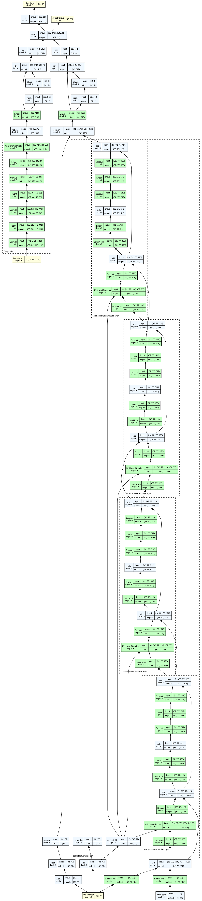

# 📘 Paper Replication: Learning Transferable Visual Models From Natural Language Supervision

> **Authors:** Alec Radford etl.
> **Published:** 2021  
> **Organization:** OpenAI  
> **Stage:** Representation


---

## 🎯 Replication Objectives

- Implement the model from the paper in a modular, transparent way.
- Replicate key experiments and results.
- Verify main claims and discuss deviations.
- Document issues, reproducibility challenges, and results.

---

## 🧩 Core Ideas

1. **Dual-Encoder Architecture for Vision–Language Alignment**
   CLIP trains two independent encoders — one for **images** (a CNN or Vision Transformer) and one for **texts** (a
   Transformer) — to project both modalities into a **shared embedding space**.
   Each encoder learns modality-specific representations, and alignment emerges only through the contrastive training
   objective, not cross-attention or multimodal fusion layers.
   → *Your implementation mirrors this with `image_backbone` and `text_transformer`, each projected to the
   same `align_feature_hidden_size`.*

2. **Contrastive Learning via Symmetric InfoNCE Objective**
   For a batch of *N* image–text pairs, CLIP computes similarity logits between every image and every text embedding (an
   *N×N* similarity matrix).
   Training minimizes a symmetric cross-entropy loss:

    * Each image should match its paired text more than others.
    * Each text should match its paired image more than others.
      This forces semantically related image–text pairs to be **close in the embedding space** and unrelated ones to be
      **far apart**.
      → *In your code, this corresponds to `logits_per_image`, `logits_per_text`, and the paired CE loss.*

3. **Unified Embedding Space with Temperature Scaling**
   Both encoders’ outputs are **L2-normalized**, ensuring that cosine similarity measures semantic alignment.
   A learnable **temperature parameter** (`logit_scale`) dynamically rescales similarities, controlling the sharpness of
   the softmax distribution — crucial for stable contrastive learning.
   → *You implement this with `self.logit_scale = nn.Parameter(log(1/0.07))` and `exp()` during forward.*

4. **Token + Positional Encoding and Masked Pooling for Texts**
   Text features are formed by summing token and positional embeddings, processing through Transformer layers, and *
   *mean-pooling non-padded tokens** to yield a single text representation.
   This avoids dependence on a `[CLS]` token and ensures robust handling of variable-length captions.
   → *Implemented via `key_padding_mask` and masked mean pooling.*

5. **Simple yet Scalable Design**
   Because CLIP avoids cross-modal fusion, it scales efficiently: any image encoder and text encoder can be swapped or
   extended independently.
   Large-scale training on noisy image–text web pairs leads to emergent zero-shot recognition, as the learned joint
   space captures rich semantic structure.

---

## ⚙️ Implementation Plan

| Component  | Description                                                           |
|------------|-----------------------------------------------------------------------|
| Model      | baseline, using CNN image encoder + 4 layer text transformer encoders |
| Dataset    | flickr8k                                                              |
| Evaluation | InfoNCE/CLIP loss                                                     |
| Notes      | Done                                                                  |

---

## 🧪 Expected Results

| Metric | Target | Notes |
|--------|--------|-------|
| TBD    | TBD    | TBD   |

---

## 🧭 Notes

- <Write short comments about the reproduction context>

## Model Architecture Interation

### CNN + 4 Layer Text Transformer Encoders

```text
===============================================================================================
Layer (type:depth-idx)                        Output Shape              Param #
===============================================================================================
CLIP                                          [32, 32]                  1
├─Sequential: 1-1                             [32, 128, 1, 1]           --
│    └─Conv2d: 2-1                            [32, 32, 112, 112]        896
│    └─ReLU: 2-2                              [32, 32, 112, 112]        --
│    └─Conv2d: 2-3                            [32, 64, 56, 56]          18,496
│    └─ReLU: 2-4                              [32, 64, 56, 56]          --
│    └─Conv2d: 2-5                            [32, 128, 28, 28]         73,856
│    └─ReLU: 2-6                              [32, 128, 28, 28]         --
│    └─AdaptiveAvgPool2d: 2-7                 [32, 128, 1, 1]           --
├─Linear: 1-2                                 [32, 512]                 65,536
├─Embedding: 1-3                              [32, 77, 128]             6,324,224
├─Embedding: 1-4                              [1, 77, 128]              9,856
├─TransformerEncoder: 1-5                     [32, 77, 128]             --
│    └─ModuleList: 2-8                        --                        --
│    │    └─TransformerEncoderLayer: 3-1      [32, 77, 128]             198,272
│    │    └─TransformerEncoderLayer: 3-2      [32, 77, 128]             198,272
│    │    └─TransformerEncoderLayer: 3-3      [32, 77, 128]             198,272
│    │    └─TransformerEncoderLayer: 3-4      [32, 77, 128]             198,272
├─Linear: 1-6                                 [32, 512]                 65,536
===============================================================================================
Total params: 7,351,489
Trainable params: 7,351,489
Non-trainable params: 0
Total mult-adds (Units.GIGABYTES): 4.29
===============================================================================================
Input size (MB): 19.29
Forward/backward pass size (MB): 253.34
Params size (MB): 28.35
Estimated Total Size (MB): 300.98
===============================================================================================
```



---

📅 Generated by **ReplicateAI**
