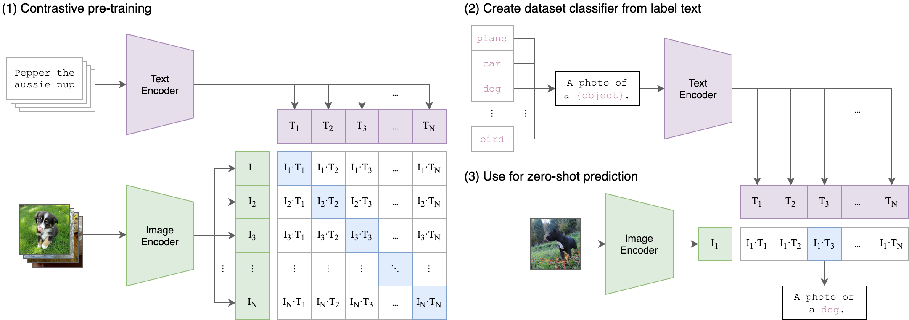

# 📘 Paper Replication: Learning Transferable Visual Models From Natural Language Supervision

> **Authors:** Alec Radford etl. 
> **Published:** 2021  
> **Organization:** OpenAI  
> **Stage:** Representation

---

## 🎯 Replication Objectives

- Implement the model from the paper in a modular, transparent way.
- Replicate key experiments and results.
- Verify main claims and discuss deviations.
- Document issues, reproducibility challenges, and results.

---

## 🧩 Core Ideas

1. <Key Idea 1>
2. <Key Idea 2>
3. <Key Idea 3>

---

## ⚙️ Implementation Plan

| Component  | Description |
|------------|-------------|
| Model      | TBD         |
| Dataset    | TBD         |
| Evaluation | TBD         |
| Notes      | TBD         |

---

## 🧪 Expected Results

| Metric | Target | Notes |
|--------|--------|-------|
| TBD    | TBD    | TBD   |

---

## 🧭 Notes

- <Write short comments about the reproduction context>

---

📅 Generated by **ReplicateAI**
